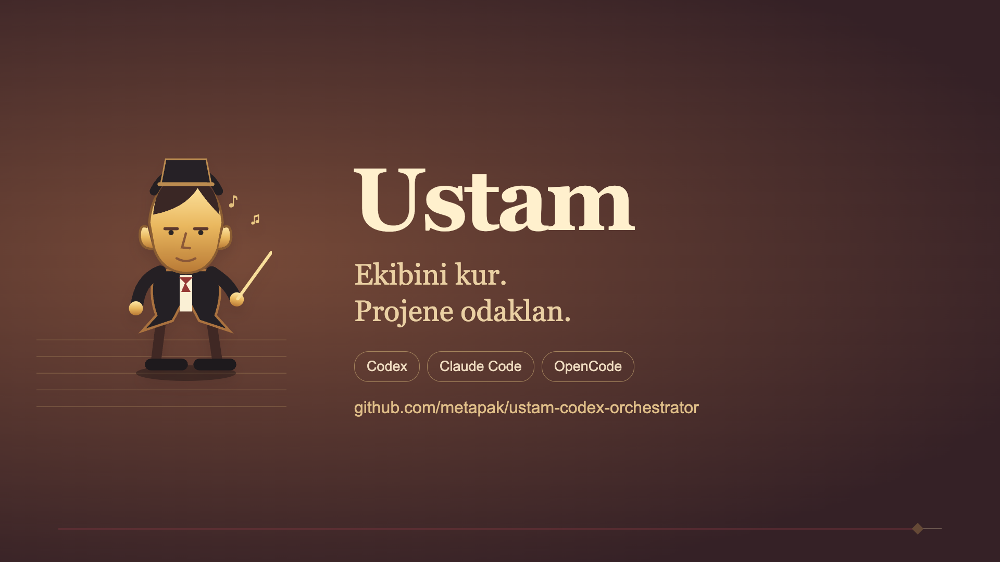

[English](README.md) | [Türkçe](README.tr.md)

  

# Ustam

One local hub for Codex, Claude Code, and OpenCode.

**Choose apps, projects, a chief, and specialist teams in one local browser page.**

Set up the team, check the changes, and see locally recorded past usage. The setup console runs on your computer. The chief coordinates and speaks with you; specialists do the assigned work. This division is an instruction rule, not a technical lock on the chief's tools.

> [!NOTE]
> This is an unofficial community project. It is not affiliated with or endorsed by OpenAI.

## Turkish introduction

[Play or download the Turkish video (MP4, 55 seconds)](https://raw.githubusercontent.com/metapak/ustam-codex-orchestrator/main/docs/assets/ustam-trailer-tr-55s.mp4). Turkish titles with original music and sound effects; no spoken narration. Usage figures shown on screen are sample data. Select the cover or MP4 link to open the video.

## Install in four steps

**Current release:** [1.0.0-beta.3](https://github.com/metapak/ustam-codex-orchestrator/releases/tag/ustam-v1.0.0-beta.3) · [Mac arm64 ZIP](https://github.com/metapak/ustam-codex-orchestrator/releases/download/ustam-v1.0.0-beta.3/ustam-1.0.0-beta.3-macos-arm64.zip) · [Release notes](docs/release-ustam-v1.0.0-beta.3.md). The Mac bundle was verified locally; public-download Gatekeeper restrictions remain unresolved. Windows/Linux links below are the previous beta.2 release.

1. **Download Ustam:** Choose the native application ZIP for Windows or Linux from the [1.0.0-beta.2 release](https://github.com/metapak/ustam-codex-orchestrator/releases/tag/ustam-v1.0.0-beta.2) and extract it completely: [Windows](https://github.com/metapak/ustam-codex-orchestrator/releases/download/ustam-v1.0.0-beta.2/ustam-1.0.0-beta.2-windows-x86_64.zip) · [Linux](https://github.com/metapak/ustam-codex-orchestrator/releases/download/ustam-v1.0.0-beta.2/ustam-1.0.0-beta.2-linux-x86_64.zip).
2. **Open:** Open **Ustam.exe** on Windows or **Ustam** on Linux. For a locally built Mac app, open **Ustam.app**. The native package includes Python. The Mac app can be moved on its own; keep the extracted Windows/Linux files together.
3. **Select apps:** Choose the apps you use: Codex, Claude Code, and OpenCode. Install and sign in to each selected provider's command-line tool.
4. **Add projects:** Add project folders in the local browser page, check the changes, then apply them.

Native builds are unsigned; Mac Gatekeeper may block the download. See [Ustam local hub](docs/ustam-hub.md) for details and advanced source/CLI use. Running the source ZIP requires Python 3.11+. Provider accounts and model access are separate requirements.

## Projects and orchestras

Add a project, select the provider you use there, then choose a saved orchestra or create one in that project's setup area. Review models and roles before saving. A saved orchestra is reusable configuration; saving it does not start a provider job. Review proposed project changes before applying them.

Configuration and previews can work offline. Starting real work requires the selected provider's CLI, login and model access. Team settings and the runtime's actual execution limits are separate; the page reports those limits. Usage/history describes recorded work, not a live orchestra animation.

## Advanced compatibility

The older provider-specific console remains available for existing projects. Its screenshots, ten-task presets and launchers are described separately in the [legacy reference](docs/legacy-console.md). Follow the [unified app guide](docs/ustam-hub.md) for current setup.

## License

[Apache-2.0](LICENSE) · [Attribution](NOTICE). This is an unofficial community project, not endorsed by provider maintainers.
